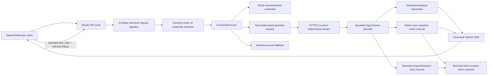

# Cursor CLI Provider Design

## Overview

Cursor CLI is implemented as a new OAuth provider and native Agent API executor. The existing Cursor IDE provider (`cursor` / `cu`) remains unchanged and continues to use `ChatService/StreamUnifiedChatWithTools`. Cursor CLI uses Cursor's OMP-compatible Agent API at `agent.v1.AgentService/Run`, generated protobuf bindings, HTTP/2, Connect framing, and a bidirectional stream.

The design targets complete end-to-end behavior rather than a transport scaffold: OAuth authorization and refresh, static and discovered models, canonical request conversion, text/reasoning streaming, client-side tool calls and continuation, bounded session/KV state where required, safe image handling, fallback classification, focused tests, build verification, and a real hosted model acceptance test.

### Design decisions

1. **Separate provider identity.** `cursor-cli` is a new provider ID and alias. Existing `cursor` and `cu` are not changed.
2. **Agent endpoint only.** Cursor CLI uses `/agent.v1.AgentService/Run`; the existing IDE endpoint is not reused.
3. **OAuth access token directly.** Cursor CLI uses Cursor's OAuth access token as bearer credential. No Devin-style session-token exchange is introduced.
4. **Generated bindings.** Agent protobuf bindings come from a verified OMP-derived `agent.proto` dependency closure. Generated files are isolated and never hand-edited.
5. **Client-side execution.** 9router never executes Cursor-requested filesystem, shell, browser, or MCP tools. It emits canonical tool calls and accepts client-provided results.
6. **Stateless-first continuation with safe state.** Every continuation attempts complete context replay. A bounded session manager is used only for native inline result delivery when the upstream requires the original bidirectional stream.
7. **Existing fallback owns account state.** The executor handles one selected credential; account selection, cooldowns, and retry policy remain in 9router's existing services.
8. **Live acceptance is required.** Focused mocks and builds are necessary but not sufficient; completion requires a deployed OAuth-backed request to a real Cursor CLI model.

## Architecture



### Provider boundaries

```text
open-sse/providers/registry/cursor-cli.js
open-sse/executors/cursor-cli.js
open-sse/executors/cursor-cli/
  protocol.js       HTTP/2, framing, heartbeat, trailers
  request.js        canonical body -> Agent protobuf
  response.js       Agent messages -> canonical OpenAI SSE
  errors.js         sanitized classification
  session.js        bounded inline continuation state
  images.js         data/remote image safety and blob encoding
  proto/            verified generated Agent dependency closure
```

`open-sse/executors/cursor-cli.js` owns orchestration only. It does not duplicate generic account selection, canonical translation, quota, or response assembly.

## Provider registration and OAuth

### Registry

The new registry entry uses:

```js
{
  id: "cursor-cli",
  alias: "cursor-cli",
  category: "oauth",
  authType: "oauth",
  authModes: ["oauth"],
  transport: {
    baseUrl: "https://api2.cursor.sh",
    chatPath: "/agent.v1.AgentService/Run",
    forceStream: true
  }
}
```

The generated registry aggregation is regenerated. The current `cursor.js` registry remains the source of the IDE contract.

### Credential shape

The standard 9router connection stores:

```js
{
  accessToken: string,
  refreshToken?: string,
  expiresAt?: number,
  providerSpecificData?: {
    clientVersion?: string,
    ghostMode?: boolean
  }
}
```

No access token, refresh token, PKCE verifier, or authorization header is returned in API responses or logs.

### OAuth flow

1. Generate PKCE verifier/challenge and UUID.
2. Build Cursor CLI deep-link URL:
   `https://cursor.com/loginDeepControl?challenge=...&uuid=...&mode=login&redirectTarget=cli`.
3. Use existing 9router OAuth route/UI to present the URL.
4. Poll `https://api2.cursor.sh/auth/poll?uuid=...&verifier=...` with bounded attempts and exponential backoff.
5. Validate `accessToken` and persist refresh data via existing connection persistence.
6. Decode JWT `exp` only for local expiry scheduling; malformed expiry uses a safe short fallback.
7. Refresh through `POST https://api2.cursor.sh/auth/exchange_user_api_key` with bearer refresh/access token and `{}` body.
8. Persist rotated credentials atomically through existing OAuth credential manager.

OAuth errors are sanitized and classified separately from model-request errors. A missing refresh token never deletes a connection; it produces a reconnection-required error after access expiry.

## Agent protobuf and transport

### Generated bindings

The source of truth is the verified OMP `agent.proto` and its generated `agent_pb` closure. Required messages initially include:

- `AgentClientMessage`, `AgentServerMessage`;
- `AgentRunRequest`, `ModelDetails`;
- conversation/action/state messages;
- interaction update and turn-ended messages;
- tool/MCP definitions and tool-call messages;
- heartbeat messages;
- end-stream/error-compatible descriptors;
- KV and exec messages needed by the selected implementation path.

The binding closure is copied atomically, imports use `.js` extensions, and generated source is excluded from hand edits. A source/version manifest records the verified reference version.

### HTTP/2 request

Cursor requires HTTP/2. The executor uses `node:http2` with proxy-aware tunnel support where configured. HTTP/1.1 fetch is not used for Agent requests because Cursor may reject it with status 464.

Headers:

```http
:method: POST
:path: /agent.v1.AgentService/Run
content-type: application/connect+proto
connect-protocol-version: 1
te: trailers
authorization: Bearer <access token>
x-ghost-mode: true
x-cursor-client-version: cli-<verified version>
x-cursor-client-type: cli
x-request-id: <uuid>
```

### Connect framing

```text
flags: 1 byte
length: 4-byte unsigned big-endian
payload: length bytes
```

`0x01` marks compression and `0x02` marks end-stream. The decoder is incremental and bounded:

- rejects lengths over `MAX_CONNECT_FRAME_PAYLOAD`;
- rejects unsupported flags and truncated frames;
- handles split/coalesced network chunks;
- decompresses only supported compression;
- parses end-stream JSON as a structured error;
- closes safely on malformed data.

### Heartbeats and cancellation

A client heartbeat is encoded as `AgentClientMessage.clientHeartbeat` and sent every five seconds while the stream is active. Timers are cleared on normal turn end, HTTP/2 error, cancellation, and session eviction. Abort closes the request and client session and prevents later writes.

HTTP/2 trailers are checked for `grpc-status` and `grpc-message`; non-zero status becomes a sanitized provider error.

## Request model

### Canonical boundary

The executor receives the canonical OpenAI-shaped body after existing OpenAI/Anthropic conversion. It does not implement a second public request format.

### Conversation construction

`request.js` builds `AgentRunRequest`:

- stable `conversationId` from client conversation ID or generated UUID;
- `userMessageAction` for a new turn;
- `resumeAction` only for a retained inline session;
- `ConversationStateStructure` references when state is retained;
- `ModelDetails` with requested model ID, display ID, and display name;
- MCP tool definitions from canonical OpenAI tools, excluding provider-native tools that 9router cannot execute;
- user/system/developer/assistant/tool history encoded in chronological order.

Tool history is normalized before encoding so assistant calls and tool results are never accidentally combined into an invalid single protobuf message.

### Generation controls

- `max_tokens` / `max_completion_tokens`: use native field if available; otherwise add a deterministic output constraint.
- `reasoning_effort`: map to verified Agent model parameters or native thinking level.
- `stop`: use native field if available; otherwise add an explicit stop constraint.
- `response_format`: encode native JSON mode if available; otherwise add a strict JSON constraint; reject unsupported schema modes when safe enforcement is impossible.
- `tool_choice`: map native selection if available; otherwise add a forcing directive for `required` or a named tool.
- unknown provider-specific fields are omitted rather than forwarded blindly.

## Response model

### Interaction updates

`response.js` decodes each `AgentServerMessage` and emits canonical OpenAI SSE:

- text deltas -> `delta.content`;
- reasoning deltas -> canonical reasoning field;
- usage/token updates -> canonical usage;
- turn-ended -> finish reason and `[DONE]`;
- model length stop -> `length`;
- tool completion -> `tool_calls` finish reason.

IDs are stable for the complete response and each tool call. Exactly one terminal finish event and one `[DONE]` are emitted for successful streams.

### Tool-call accumulation

Per-stream state contains:

```js
{
  calls: Map<CursorCallId, {
    openAiId,
    index,
    name,
    argumentBuffer,
    emittedArgumentLength
  }>,
  activeCallId
}
```

Cursor cumulative argument snapshots are compared with `argumentBuffer`. If the new value starts with the old value, only the suffix is emitted. Argument-only messages resolve to `activeCallId`; a new call requires a non-empty name or known ID. IDs are normalized only where the protocol adds a documented suffix; arbitrary IDs are preserved.

### Error and fallback boundary

Before valuable output, executor errors return a normal non-success `Response` so existing account fallback can act. After valuable output, the stream emits a sanitized terminal error and closes; the request is never replayed.

## Tool execution, sessions, and KV

### Client-side execution contract

Native Cursor exec requests are never executed by 9router. The executor translates representable requests to canonical tool calls. The client executes them and sends the next request with assistant `tool_calls` plus `role: "tool"` results.

If the Agent API requires the result on the same stream, `session.js` sends only the client-provided matching result through the native result message. It never invents a result.

### Session manager

Session state is opt-in and bounded:

```js
Map<conversationId, {
  connectionKey,
  request,
  pendingCalls,
  blobs,
  lastActivityAt,
  expiresAt
}>
```

Limits include maximum sessions, pending calls, blobs, blob bytes, and idle TTL. Eviction closes HTTP/2 resources and removes all buffers. A session is acquired only when connection identity and pending call ID match. Otherwise the executor uses full context replay or returns a safe client error.

### KV blobs

Blob IDs are SHA-256-derived and scoped to the session/request. KV get/set accepts only known IDs, bounded sizes, and expected content types. Unknown, expired, or cross-session IDs return native not-found/error messages. No blob is persisted to the database or exposed to clients.

## Vision

`images.js` follows OmniRoute's safety boundary:

- data URI must be base64 and `image/*`;
- strict per-image byte limit and image-count limit;
- remote URLs pass the shared public outbound URL guard;
- redirects are manually followed and revalidated;
- DNS/IP private-range checks and timeout are enforced;
- image content is represented through the verified Agent selected-image/blob schema;
- malformed/unsafe images are client errors and never trigger account fallback.

Vision is not advertised in capabilities until a live Agent model has accepted and semantically used a controlled image test.

## Model discovery

`GetUsableModels` is a separate bounded HTTP/2 unary operation using the selected access token. It decodes the generated response, validates IDs, de-duplicates, and maps display/reasoning/modality metadata. Discovery failure, timeout, malformed data, or an empty result preserves static fallback models and does not mark the connection unavailable.

The initial static set is deliberately small and verified. New models are added only through validated discovery or explicit tested registry updates. Fast/parameterized IDs are normalized in one resolver and retain the user-selected display ID for responses.

## Error classification

| Condition | HTTP/client behavior | Account fallback |
|---|---|---|
| OAuth polling/refresh failure | sanitized auth error | refresh/reconnect policy |
| 401/403 before output | auth error | existing refresh/fallback |
| explicit temporary account limit | 429-style provider error | cooldown/next account |
| explicit quota/credits exhausted | 429-style quota error | longer cooldown, no deletion |
| generic capacity/resource exhausted | upstream error | bounded existing retry; not quota |
| invalid model/request/tool/image | 400 client error | no account rotation |
| malformed/truncated protobuf | protocol/upstream error | pre-output fallback only |
| failure after output | terminal SSE error | never replay |

All error messages pass credential and sensitive-content sanitization before logging or client emission.

## Testing strategy

### Unit tests

- OAuth PKCE URL, polling backoff, success, timeout, malformed response, refresh, expiry, and redaction.
- Generated protobuf request fixtures and field-level semantic decode.
- Frame split/coalesce, compression, end-stream, trailers, bounds, invalid flags, and cancellation.
- Heartbeat start/stop and cleanup.
- Request role/history replay and generation controls.
- Text/reasoning/usage/finish translation.
- Tool IDs, indexes, cumulative JSON snapshots, continuations, parallel calls, missing fields, and client result replay.
- Session TTL, max count, identity isolation, stale pending calls, and cleanup.
- KV bounds and isolation.
- Image data URI/remote URL, SSRF, redirects, DNS, size/count, timeout, and sanitized failures.
- Error classification and pre/post-output fallback.
- Registry, capabilities, aliases, routes, and regression protection for existing `cursor`/`cu`.

### Integration tests

Mock HTTP/2 or use a deterministic local HTTP/2 test server to exercise a complete bidirectional turn, heartbeat, tool-call output, client result continuation, and terminal trailers. No real credentials or external network calls are used in automated tests.

### Build and baseline

Run focused Cursor CLI tests, existing Cursor IDE tests, provider baseline checks, and `npm run build`. Review generated binding diff and verify no local config or token files are staged.

### Hosted acceptance

After deployment/reload and with an authorized Cursor CLI connection:

1. OAuth connection completes in the dashboard.
2. Static/discovered model appears.
3. A simple deterministic prompt returns a valid response.
4. A reasoning-capable model preserves reasoning metadata without leaking private content.
5. Tool test returns a client-side OpenAI tool call; 9router does not execute it.
6. A follow-up request with a fake controlled tool result completes.
7. If image support is advertised, a controlled image prompt confirms semantic image use.
8. Logs and responses contain no token, authorization header, or image content.

Hosted acceptance is recorded separately from mocked tests and is required before declaring the provider complete.
