# Devin Provider Design

## Overview

The Devin integration is a native 9router provider backed by Devin/Codeium's Connect/protobuf API. A user stores one Devin session token per standard 9router connection. Existing 9router infrastructure owns credential storage, rotation, cooldowns, proxy routing, request format translation, response format translation, streaming delivery, non-streaming assembly, and usage persistence.

A dedicated `DevinExecutor` owns only provider-specific behavior:

- session-token normalization;
- `GetUserJwt` authentication exchange;
- canonical OpenAI request body to Devin protobuf conversion;
- Connect framing, gzip, and bounded incremental decoding;
- Devin protobuf response to canonical OpenAI SSE conversion;
- sanitized Devin error classification.

The integration does not embed the standalone DevinRouter, read TOML, run a watcher, create a second pool, or spawn a Devin CLI process.

### Key decisions

1. **Native executor, native 9router pooling.** Account selection remains in `getProviderCredentials()` and fallback remains in `accountFallback.js`. The executor processes exactly one selected credential per invocation.
2. **Canonical OpenAI is the executor boundary.** Existing OpenAI/Anthropic translators normalize messages, tools, tool history, images, and output formats. The executor adapts that canonical body to protobuf and returns canonical OpenAI SSE.
3. **Static model first.** `swe-1-6-slow` is the guaranteed model. Live discovery is optional, bounded, cached through existing model-route conventions, and never required for chat.
4. **Vision is implemented, not only advertised.** Devin's protobuf schema already exposes `ChatMessagePrompt.images: ImageData[]`; the request adapter maps canonical `image_url` content into this field.
5. **No failover after output starts.** Provider errors before a usable response may enter 9router account fallback. Once valuable SSE content has been emitted, the stream terminates with an error rather than restarting on another account.
6. **Copied generated bindings remain generated code.** Required protobuf modules are copied as an intact dependency closure into a dedicated Devin protocol directory, excluded from lint/format where appropriate, and never hand-edited.

## Architecture

```mermaid
flowchart LR
    Client[OpenAI or Anthropic Client] --> Route[9router API Route]
    Route --> Select[getProviderCredentials]
    Select --> Translate[Existing request translators]
    Translate --> Core[handleChatCore]
    Core --> Executor[DevinExecutor]

    Executor --> Normalize[Normalize session token]
    Normalize --> Auth[GetUserJwt]
    Auth --> Build[Build Devin protobuf request]
    Build --> Chat[GetChatMessage Connect stream]
    Chat --> Decode[Bounded frame decoder]
    Decode --> Canonical[Canonical OpenAI SSE]

    Canonical --> Stream[Existing stream handler]
    Stream --> ResponseTranslate[Existing response translators]
    ResponseTranslate --> Client

    Executor -->|pre-output provider error| Fallback[accountFallback]
    Fallback --> Select
    Executor -->|post-output stream error| Terminate[Sanitized terminal error]
```



## Component boundaries

### Provider registry

A new `open-sse/providers/registry/devin.js` is the single source of truth for Devin metadata.

Proposed identity:

```js
{
  id: "devin",
  alias: "devin",
  category: "api-key",
  display: {
    name: "Devin",
    icon: "/providers/devin.png",
  },
  auth: {
    modes: ["api_key"],
  },
  transport: {
    baseUrl: "https://server.codeium.com",
    format: "openai",
    forceStream: true,
  },
  models: [
    {
      id: "swe-1-6-slow",
      name: "SWE-1.6 Slow",
      contextWindow: 200000,
    },
  ],
}
```

Exact field names follow `REGISTRY_TEMPLATE.js` and `schema.js` during implementation. No OAuth block is added: the supplied Devin session token is an API-key-style credential even though the executor exchanges it for a short-lived user JWT.

The generated registry index is regenerated using the repository's registry generation command. It is not edited as an independent source of truth.

### Capability metadata

`open-sse/providers/capabilities.js` receives an exact Devin model capability entry before any generic patterns:

- vision/image input: enabled;
- tool calls: enabled;
- reasoning/thinking: enabled when the existing capability shape supports it;
- context window: 200,000;
- audio/PDF: unchanged unless existing image/PDF normalization explicitly supports the upstream representation.

The capability entry allows `stripUnsupportedModalities()` to preserve images before the executor runs.

### Executor registration

`open-sse/executors/index.js` imports, instantiates, and exports `DevinExecutor` under `devin`. No default executor fallback is used because Devin is not HTTP JSON/SSE compatible at the wire boundary.

## DevinExecutor interface

`DevinExecutor` follows the established custom binary-provider pattern used by Cursor and Kiro while keeping Devin-specific logic isolated.

Conceptual interface:

```js
class DevinExecutor extends BaseExecutor {
  async execute({ model, body, stream, credentials, signal, log, proxyOptions }) {
    // Returns { response, url, headers, transformedBody }
  }
}
```

Responsibilities:

1. Validate the model against the supported/discovered Devin model set.
2. Extract the selected connection credential from the standard credentials object.
3. Normalize the session token.
4. Exchange it for a user JWT.
5. Build a protobuf request from the canonical OpenAI body.
6. Use `proxyAwareFetch` for auth and chat requests.
7. Decode upstream frames into a web `ReadableStream` of canonical OpenAI SSE.
8. Return a standard Web `Response` with `Content-Type: text/event-stream` even for a client non-streaming request; existing `forceStream` and non-streaming assembly handle the client contract.

The executor does not select another credential and does not mutate connection state directly.

## Protocol module

Provider-specific protocol code lives under:

```text
open-sse/executors/devin/
├── protocol.js
├── request.js
├── response.js
├── errors.js
└── proto/              # generated dependency closure
```

This split is justified because generated protobuf bindings are large and the pure request/response adapters require focused tests. `open-sse/executors/devin.js` remains the orchestration entry point.

### Constants

All mutable upstream compatibility constants are centralized in `protocol.js`:

- default API URL;
- auth path;
- chat path;
- IDE version;
- extension version;
- session-token prefix;
- maximum Connect frame payload;
- default request timeout inherited from 9router runtime configuration.

### Token normalization

Normalization strips repeated leading prefixes and emits exactly one prefix:

```text
raw-jwt
→ devin-session-token$raw-jwt

prefix$raw-jwt
→ devin-session-token$raw-jwt

prefix$prefix$raw-jwt
→ devin-session-token$raw-jwt
```

Empty or whitespace-only values fail before any fetch.

### Authentication exchange

The executor serializes `GetUserJwtRequest` and sends it to `GetUserJwt` using `proxyAwareFetch`, the selected proxy configuration, and the request abort signal.

The response decoder:

1. validates HTTP status;
2. reads a bounded payload;
3. attempts plain protobuf decoding;
4. attempts gzip decoding only when needed;
5. requires a non-empty `userJwt`;
6. accepts `customApiServerUrl` only after URL validation.

A custom API URL must be HTTPS and must pass existing proxy/transport safety assumptions. Credentials are never interpolated into the URL or logs.

### Chat request framing

The serialized `GetChatMessageRequest` is gzip-compressed and wrapped in a Connect data frame:

```text
byte 0: compression flag
bytes 1-4: unsigned big-endian payload length
bytes 5..n: protobuf payload
```

The payload length is checked before concatenation and send.

## Canonical request mapping

The executor receives the OpenAI chat body produced by 9router's existing translator pipeline.

### System/developer messages

- Leading system/developer instructions are accumulated into the request-level prompt according to existing canonical semantics.
- Developer messages that remain in history map to user-compatible prompt entries only when required by Devin's source enum.
- Content order is preserved.

### Text content

OpenAI string content maps directly to `ChatMessagePrompt.prompt`.

Array content is partitioned without changing order semantics:

- `text` blocks contribute to prompt text;
- `image_url` blocks become `ImageData` entries;
- unsupported blocks follow existing modality stripping/rejection before execution.

### Image content

For a canonical image block:

```js
{
  type: "image_url",
  image_url: { url: "data:image/png;base64,..." }
}
```

The adapter uses existing image helpers to parse or safely fetch the source, then creates:

```text
ImageData.base64Data = decoded base64 bytes/string expected by generated schema
ImageData.mimeType   = validated MIME type
ImageData.caption    = optional/empty
```

Remote images use 9router's existing SSRF-hardened image fetcher and size/type validation. No new unrestricted fetch path is introduced.

### Tool definitions

Canonical OpenAI tools:

```js
{
  type: "function",
  function: {
    name,
    description,
    parameters,
  },
}
```

map to `ChatToolDefinition`:

- `name` → name;
- `description` → description;
- `parameters` → serialized JSON schema expected by the proto;
- custom-tool marker enabled where required by Devin.

Tool choice maps to `ChatToolChoice` only for choices supported by Devin. Unsupported forced-choice shapes are rejected or normalized consistently with 9router conventions rather than silently changing intent.

### Assistant tool calls

Canonical assistant `tool_calls[]` map to `ChatMessagePrompt.toolCalls[]` using:

- stable ID;
- function name;
- exact arguments JSON string;
- custom tool-call marker.

Assistant text and tool calls may coexist on the same prompt.

### Tool results

Canonical `role: "tool"` messages map to:

- `ChatMessageSource.TOOL`;
- `toolCallId` from `tool_call_id`;
- prompt text from tool result content;
- `toolResultIsError` when the canonical representation carries an error state.

### Generation configuration

Supported values map to `CompletionConfiguration`:

- temperature;
- max output tokens;
- stop sequences;
- prompt caching defaults already verified by DevinRouter.

Unsupported sampling fields are stripped or rejected through existing executor conventions. Defaults are applied only when the client did not supply a supported value.

## Response conversion

The decoder consumes arbitrary byte chunks and keeps a pending buffer. It parses frames only after receiving the full five-byte header and declared payload.

### Frame handling

- Data frame: optional gunzip, protobuf decode, event conversion.
- End/trailer frame: JSON decode, upstream error classification, stream completion.
- Unknown legal fields: handled by generated protobuf runtime.
- Oversized or truncated terminal payload: sanitized protocol error.
- Client abort: reader cancellation and upstream abort propagation.

### Canonical OpenAI SSE

Each decoded protobuf response produces zero or more canonical SSE events.

Text:

```js
{ choices: [{ delta: { content: text } }] }
```

Thinking:

```js
{ choices: [{ delta: { reasoning_content: text } }] }
```

Tool calls:

```js
{
  choices: [{
    delta: {
      tool_calls: [{
        index,
        id,
        type: "function",
        function: { name, arguments },
      }],
    },
  }],
}
```

A per-stream map assigns a stable index to each upstream tool-call ID. Name and ID are emitted on the first delta; argument data is emitted without changing identity.

Usage:

```js
{
  choices: [],
  usage: {
    prompt_tokens,
    completion_tokens,
    total_tokens,
  },
}
```

Termination:

- `MAX_TOKENS` → `finish_reason: "length"`;
- tool completion where required → `finish_reason: "tool_calls"`;
- normal completion → `finish_reason: "stop"`;
- final `[DONE]` event.

Existing response translators convert canonical OpenAI SSE into Anthropic or other requested client formats.

## Streaming lifecycle and retry boundary

The executor distinguishes two states:

```text
PRE_OUTPUT → VALUABLE_OUTPUT_SENT → TERMINAL
```

Valuable output includes:

- non-empty text;
- non-empty reasoning;
- any tool-call identity or arguments;
- a terminal successful completion.

Before valuable output, HTTP/auth/trailer errors are returned as normal failed executor responses/errors and may be classified by 9router account fallback.

After valuable output, a later Devin error is emitted as a sanitized stream failure/termination. The executor must not internally restart with another account, and outer account fallback must not replay the request.

`DevinExecutor` does not implement an independent account retry loop. Base transport retries are limited to failures that occur before response streaming begins and follow runtime retry limits.

## Error model

`errors.js` provides pure classification functions shared by HTTP and trailer failures.

### Categories

| Category | Evidence | Account behavior |
|---|---|---|
| temporary account limit | explicit account/message rate-limit wording | short cooldown and fallback before output |
| definitive quota | explicit quota/usage-limit/credits plus exhausted/exceeded/depleted/reached | longer model/account cooldown and fallback before output |
| authentication | HTTP 401/403 or auth-specific Connect status | existing auth/fallback policy; no permanent deletion |
| model capacity | capacity/overloaded/resource exhaustion without account evidence | transient/global error; no definitive quota classification |
| invalid model/request | HTTP 400/404 or explicit unsupported model/validation signal | client error; no account cycling |
| upstream/network | bounded 5xx/network failures | existing retry/fallback rules |
| protocol | malformed/oversized/truncated frames | sanitized upstream error |

Generic HTTP 429 alone is not definitive quota. Text rules are intentionally conservative and protected by false-positive tests.

To integrate with `accountFallback.js`, the executor returns sanitized status and error text/codes that existing `checkFallbackError()` can classify. Devin-specific rules are added to `errorConfig.js` only when generic rules cannot distinguish temporary limit, definitive quota, and invalid model safely.

Connection state uses existing cooldown/model-lock fields. No Devin connection is permanently removed or rewritten by the executor.

## Model discovery

### Initial implementation

The registry always exposes `swe-1-6-slow`. This is sufficient for complete initial provider functionality.

### Optional live resolver

A Devin custom resolver may be added to `src/app/api/providers/[id]/models/route.js` only if the copied discovery protocol can be integrated cleanly.

The resolver:

1. obtains the selected stored Devin credential through existing route conventions;
2. uses a bounded proxy-aware request;
3. validates every returned model ID and display name;
4. omits malformed or disabled models;
5. caches only sanitized model metadata;
6. falls back to the static model on every failure;
7. does not update account error/cooldown state for discovery failure;
8. never caches or returns the exchanged user JWT.

Discovery is excluded from the initial integration because the available discovery path would require a second credential-selection flow outside the request executor. The static `swe-1-6-slow` model satisfies the provider contract independently; a future resolver must reuse the standard selected connection and preserve this fallback before it is introduced.

## Data and security

No database migration is required. Standard `providerConnections.data` stores the credential using the existing API-key/access-token field convention selected by the registry form.

Sensitive values:

- session token: stored using existing connection credential handling;
- user JWT: request-local memory only;
- authorization/connect metadata: request-local memory only;
- account diagnostic: internal connection ID only.

Logging helpers receive sanitized metadata. Raw upstream bodies are sanitized before logging because they may echo request metadata.

## File changes

Expected production files:

```text
open-sse/providers/registry/devin.js
open-sse/providers/registry/index.js          # generated
open-sse/providers/capabilities.js
open-sse/executors/index.js
open-sse/executors/devin.js
open-sse/executors/devin/protocol.js
open-sse/executors/devin/request.js
open-sse/executors/devin/response.js
open-sse/executors/devin/errors.js
open-sse/executors/devin/proto/**             # generated bindings
public/providers/devin.png
```

Conditional files:

```text
open-sse/config/errorConfig.js
src/app/api/providers/[id]/models/route.js
src/app/api/v1/models/route.js
```

No changes are planned for `chatCore.js`, generic OpenAI/Anthropic translators, database schema, account selector, or combo router unless a focused test proves a missing generic contract.

## Testing strategy

### Registry and capability tests

- Devin entry passes registry schema/baseline validation.
- Alias resolves to the provider.
- Static model ID is exact.
- Vision is preserved by modality filtering.
- Credential form requires only the token field.

### Protocol unit tests

Using fake credentials and mocked fetch only:

- token normalization: raw, prefixed, repeated prefix, whitespace, empty;
- auth protobuf request and plain/gzip response;
- validated custom API URL;
- Connect request header/length/compression;
- response frame split across chunks;
- multiple frames in one chunk;
- compressed and uncompressed frames;
- trailer success/error;
- oversized/truncated payload;
- abort and reader cancellation.

### Request adapter tests

- text-only conversation;
- system/developer history;
- data-URI image;
- safely mocked remote image;
- function definitions and tool choice;
- assistant tool calls;
- tool results and call IDs;
- supported generation options;
- unsupported model rejection.

Tests decode the generated protobuf request and assert observable fields rather than source text.

### Response adapter tests

- text and reasoning deltas;
- multiple/interleaved tool calls with stable indexes;
- usage conversion;
- stop, length, and tool-call finish reasons;
- canonical SSE can be translated by existing Anthropic response translator;
- non-streaming handler assembles the stream correctly.

### Fallback tests

- temporary limit before output permits next account;
- explicit quota before output applies longer cooldown;
- generic 429 is not permanent quota;
- auth failure follows existing policy;
- capacity failure is not definitive account quota;
- invalid model does not rotate accounts;
- failure after text/reasoning/tool output does not retry;
- retry count remains bounded.

### Verification sequence

1. Focused Devin protocol/request/response tests.
2. Focused fallback and translator integration tests.
3. Existing provider registry and alias baselines.
4. Existing affected account-fallback tests.
5. Application build.

All upstream I/O is mocked. No real Devin token is used or committed.

## Known risks and mitigations

| Risk | Mitigation |
|---|---|
| Generated proto dependency closure is large | Copy only the compiler-reported import closure; isolate and exclude generated files from manual formatting |
| Devin upstream version constants change | Centralize constants and cover required headers/metadata in tests |
| Custom API URL could bypass expected routing | Require validated HTTPS URL and route it through proxy-aware fetch |
| Image advertised but not encoded | Decode the outbound protobuf in image tests and assert `ChatMessagePrompt.images` |
| Duplicate content after failover | Track valuable output and prohibit post-output replay |
| Quota regex disables healthy accounts | Conservative classifier plus generic-429/capacity false-positive tests |
| Tool-call deltas lose identity | Maintain per-stream ID-to-index map and test interleaving |
| Discovery destabilizes chat | Static canonical model is unconditional; discovery is optional and isolated |
| Sensitive auth data appears in diagnostics | Sanitize errors/logs and use fake-token leak assertions |
